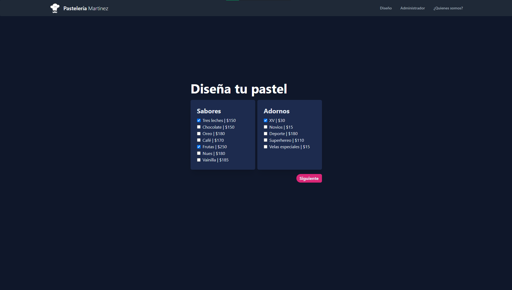
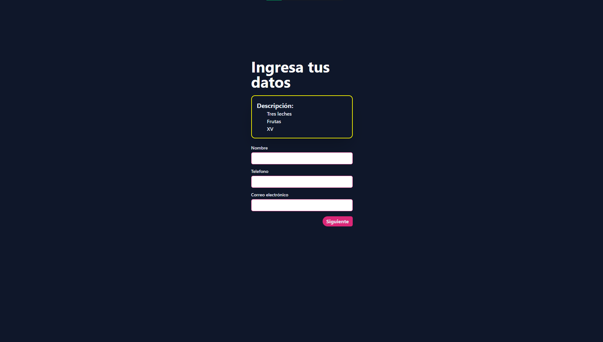
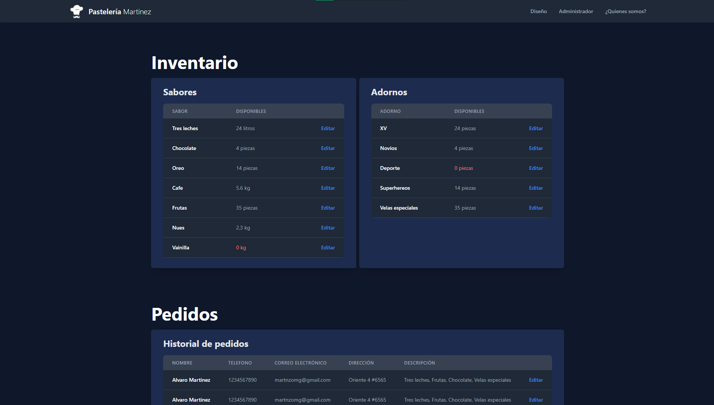
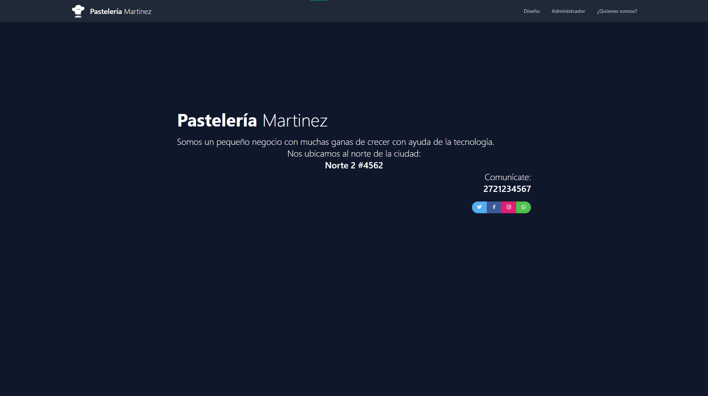

# Pastelería Martinez

## Logo

Crear marca de la pastelería como un logo y los mensajes que daremos desde la marca.

    

## Diseño de pastel

El cliente de la pastelería necesita ver los diferentes sabores de pasteles, así como los precios de cada uno.
El cliente de la pastelería necesita ver los diferentes adornos con los que se puede decorar el pastel y los precios de cada uno.
El cliente de la pastelería tendrá la posibilidad de combinar sabores dependiendo de sus preferencias.
El cliente de la pastelería tendrá la posibilidad de combinar adornos dependiendo de sus preferencias.

    

## Formulario Datos del cliente

El cliente de la pastelería necesita poner en un formulario su pedido.
El formulario debe de contener los datos de contacto del cliente que son Nombre, Teléfono, Correo Electrónico, 
Descripción general del pastel y la selección de sabores y adornos.

    

## Inventario

El pastelero necesita tener la información de la cantidad de sabores que le quedan para hacer los pasteles.
El pastelero necesita tener la información de la cantidad de adornos que le quedan para hacer los pasteles.
El pastelero necesita una tabla donde aparezcan los pedidos que se han realizado con los datos del formulario.

    

## Informacion de la pastelería

La página debe tener información de la pastelería que es Dirección, Teléfono y horarios de atención.

    

