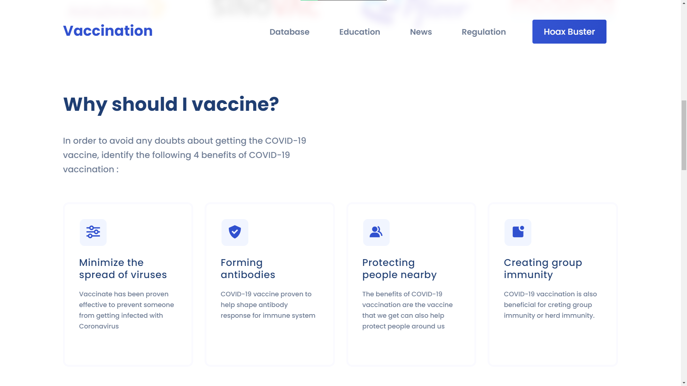
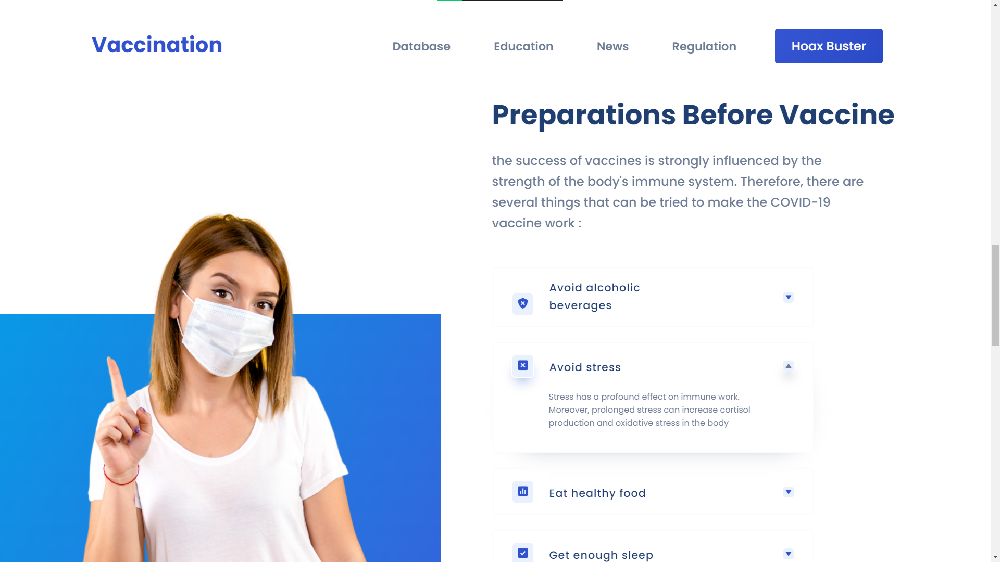
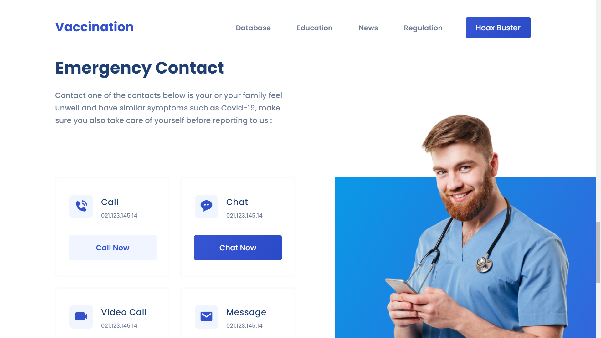
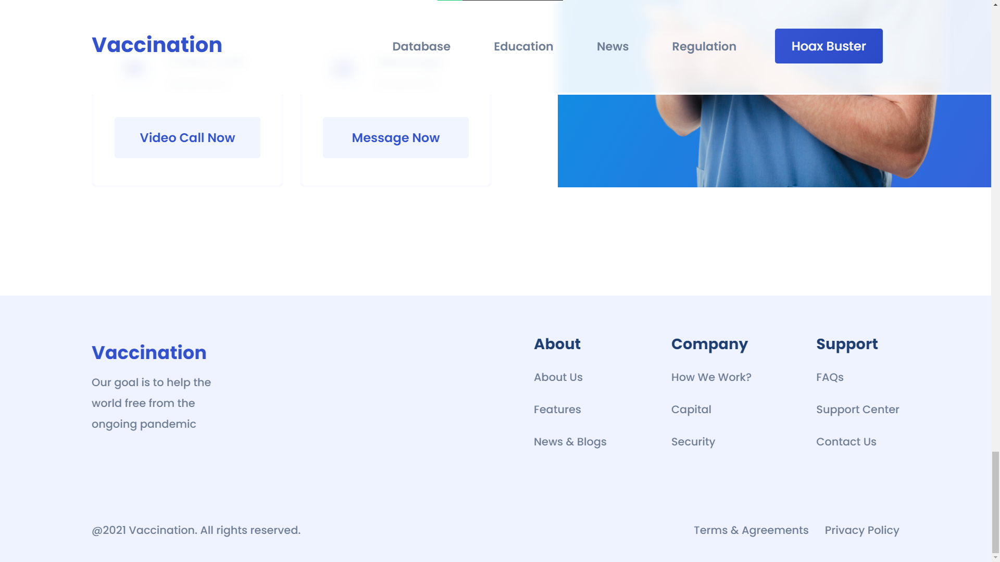

# Frontend Vaccination

### Proyecto desarrollado con solo ```HTML``` y ```CSS```. 
Acontinuación se muestran imagenes finales de ```Frontend```

## Fight Virus With Vaccines

<p align="center">
    
</p>

## Why should I vaccine?

<p align="center">
    
</p>

## Preparations Before Vaccine

<p align="center">
    
</p>

## Emergency Contact

<p align="center">
    
</p>

## Footer

<p align="center">
    
</p>